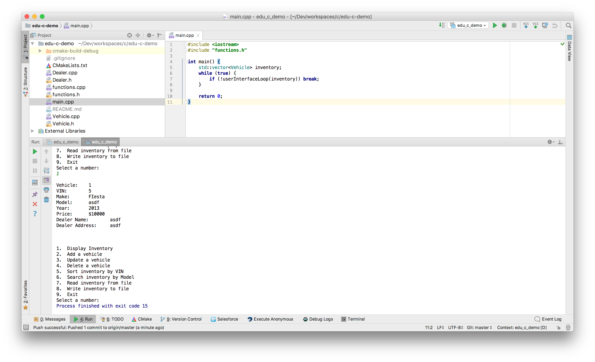

edu-c-demo
==================

This code was written specifically to as a summer test in order to get into CSCI2312 at University of Colorado Denver in the Fall 2017 Semester.

It's not an ideal project to professional software development skills.

### Other Projects ###
Checkout my other projects at [http://www.jakebillings.com](http://www.jakebillings.com) or contact me via [LinkedIn](https://www.linkedin.com/in/jake-billings/).

Checkout my [C++ Blockchain Implementation](https://github.com/jake-billings/research-blockchain).